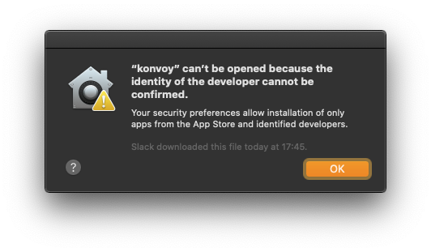

# notarizer

macOS binary packaging and notarization frontend.

Depends on Xcode commandline tools as well as [gon](https://github.com/mitchellh/gon), a tool that allows us to poll the notarizing session status easily. Wraps gon by adding steps needed for codesigning and packaging into a macOS package `pkg` installer.

The input is a tarball containing the files for distribution. The resulting macOS installer package will be entirely signed and notarized. The notarizing results are stapled towards the package, allowing for airgapped installations.


## Preparation

### Application Specific Password

The password this document later on refers to is not the developer account password as entered into the developer portal. Instead it is an application specific password one can create via the [Apple account management](https://appleid.apple.com/account/manage).

### Code & Installer Signing Identity

Check whether the application and installer signing certificates were properly installed and get their names;

```bash
security find-identity
```

Example
```
Policy: X.509 Basic
 Matching identities
 1) 04061D266E3097D4FEC9682C48CC1676923CA72D "Mac Developer: Till Toenshoff (359X484G5G)" (CSSMERR_TP_CERT_EXPIRED)
 2) 1CA595637509E3414FCBBC04CC70AF8A25CA3AE9 "Developer ID Application: Till Toenshoff (YK4D72U3YW)"
 3) BB89DE48FF589E465081CB0FBBECB863F8424F31 "Developer ID Installer: Till Toenshoff (YK4D72U3YW)"
 4) F55A517E699593F7CCBDBF8F2A9D78FD68ED44A5 "Apple Development: Till Toenshoff (359X484G5G)"
 4 identities found

Valid identities only
 1) 1CA595637509E3414FCBBC04CC70AF8A25CA3AE9 "Developer ID Application: Till Toenshoff (YK4D72U3YW)"
 2) BB89DE48FF589E465081CB0FBBECB863F8424F31 "Developer ID Installer: Till Toenshoff (YK4D72U3YW)"
 3) F55A517E699593F7CCBDBF8F2A9D78FD68ED44A5 "Apple Development: Till Toenshoff (359X484G5G)"
 3 valid identities found
```

### iTunes Provider

If the signing developer account is member of multiple developer teams, the provider is needed to identify the iTunes account / team. In case the below returns only one line, we won't need to specify the provider later on. `DEVELOPER_ACCOUNT_USER` is the account user name as used for an account login at https://developer.apple.com.

Note how we make use of an [Application Specific Password](#application-specific-password) here - provided as `AC_PASSWORD`.

```bash
xcrun iTMSTransporter -m provider -u DEVELOPER_ACCOUNT_USER -p AC_PASSWORD
```

Example
```
Provider listing:
 - Long Name - - Short Name -
1 Mesosphere Inc. JQJDUUPXFN
2 Till Toenshoff|1054576390 YK4D72U3YW
```

### gon

Make sure you are using a gon version > 0.2.2. Currently the latest release is 0.2.2 which forces us to get the latest master version instead which has support for the `provider` parameter via https://github.com/mitchellh/gon/commit/8fd67c663c53c0763b27eb9169ab3f5324cfcb75.

## Usage

|    |                          |                                                      |
|----|--------------------------|------------------------------------------------------|
| -a | --archive                | tarball containing all contents for distribution     |
| -i | --app_id                 | unique application identifier                        |
| -v | --app_version 	        | application version                                  |
| -c | --codesign_identity      | certificate identity usable for signing code         |
| -p | --productsign_identity   | certificate identity usable for signing installer    |
| -d | --destination            | installation destination folder - ["/usr/local/bin"] |
| -u | --developer_account_user | apple developer account user name                    |
| -r | --provider               | apple developer account team identifier - [""].      |
| -o | --package_name           | output package name - ["package"]                    |
| -h | --help                   |                                                      |

Make sure you provide the [Application Specific Password](#application-specific-password) using the environment variable `AC_PASSWORD`.

Example
```bash
AC_PASSWORD=XXXXX notarizer.sh \
    -a test.tar.gz \
    -i org.foo.bar \
    -v 0.0.1 \
    -c "Developer ID Application: Till Toenshoff (YK4D72U3YW)" \
    -p "Developer ID Installer: Till Toenshoff (YK4D72U3YW)" \
    -u tills@email.com \
    -r "YK4D72U3YW" \
    -o "test"
```

The first steps will be processed quickly;
- extracting the given tarball
- signing all the executables found
- packaging
- signing the package

Then comes the notarizing step which may take minutes or even hours, be very careful with tight timeouts. During notarizing, the process will frequently poll Apple's services for a result.

The output will end with something like this;
```
[...]
2020-01-30T16:27:58.290+0100 [INFO]  notarize: notarization info: uuid=cf837823-63af-4e19-aaaf-700b711053b8 info="&{cf837823-63af-4e19-aaaf-700b711053b8 2020-01-30 15:25:26 +0000 UTC b69e187699d6d4fb23f3a4c6b0a24010ef243c7e91c2c7679cd13229c552f404 https://osxapps-ssl.itunes.apple.com/itunes-assets/Enigma113/v4/7f/b1/c4/7fb1c4ea-1ed6-108c-3ca8-8db3fc0bc63b/developer_log.json?accessKey=1580592478_3772319710354698879_k8BNI0T0xSt33Seeyf5%2BwzUTJWX18tWozLqYGt%2F9gb5fTsCOgUyyCFTzmdKRw3KCltmHb10UDLNjaC9%2FPDc0oJc7ILMJRg9uPBvMe5VTvebINlI9VC10jRpAfi4i0riw8G8GibAD0sdSxAWtM7bOOyAeoZOPvcuhj2tGWCFTINY%3D success Package Approved}"
    Status: success
2020-01-30T16:27:58.290+0100 [INFO]  downloading log file for notarization: request_uuid=cf837823-63af-4e19-aaaf-700b711053b8 url=https://osxapps-ssl.itunes.apple.com/itunes-assets/Enigma113/v4/7f/b1/c4/7fb1c4ea-1ed6-108c-3ca8-8db3fc0bc63b/developer_log.json?accessKey=1580592478_3772319710354698879_k8BNI0T0xSt33Seeyf5%2BwzUTJWX18tWozLqYGt%2F9gb5fTsCOgUyyCFTzmdKRw3KCltmHb10UDLNjaC9%2FPDc0oJc7ILMJRg9uPBvMe5VTvebINlI9VC10jRpAfi4i0riw8G8GibAD0sdSxAWtM7bOOyAeoZOPvcuhj2tGWCFTINY%3D
    File notarized!
    Stapling...
2020-01-30T16:27:59.351+0100 [INFO]  staple: executing stapler: file=/var/folders/66/mgr662nx7t90lspb7wjg8ctr0000gn/T/notarizer.e6pKWgtF/test.pkg command_path=/usr/bin/xcrun command_args=[xcrun, stapler, staple, /var/folders/66/mgr662nx7t90lspb7wjg8ctr0000gn/T/notarizer.e6pKWgtF/test.pkg]
2020-01-30T16:27:59.734+0100 [INFO]  staple: stapling complete: file=/var/folders/66/mgr662nx7t90lspb7wjg8ctr0000gn/T/notarizer.e6pKWgtF/test.pkg
    File notarized and stapled!

Notarization complete! Notarized files:
  - /var/folders/66/mgr662nx7t90lspb7wjg8ctr0000gn/T/notarizer.e6pKWgtF/test.pkg (notarized and stapled)
```

The resulting package file should now be found in the location where the script was invoked.

Example
```
-rw-r--r--  1 till staff 42518342 Jan 30 16:27 test.pkg
```


## Background

The process of notarization does currently appear to only check a few things and from the common issues error message page we can deduct;

> The signature of the binary is invalid.
> The binary is not signed with a valid Developer ID certificate.
> The signature does not include a secure timestamp.

- checks for proper signatures

> The executable requests the com.apple.security.get-task-allow entitlement.

- checks for widened debugging rights not being embedded

> The binary uses an SDK older than the 10.9 SDK.
> The executable does not have the hardened runtime enabled.

- checks for safe use of linked system libraries version higher than 10.9
	+ safe use in this context means that e.g. we don't do JIT compilation via system functions


## User experience on macOS 10.15.3 (19D76)

* Downloaded unsigned and unnotarized content, now trying to run
    - Will not work at all

The user will be told that the app was from an unknown developer and the only sane solution was to delete it via bin.


* Downloaded signed but unnotarized content, now trying to run
    - Will not work at all

The user will get informed that the app needs an update -- note how here we are not asked to delete:


* Downloaded signed and notarized content (via ZIP or raw), now trying to run it
    - Will work fine when run from the terminal while connected to the interwebs, will **not** work when using Finder. Finder bug?

Finder will still claim unknown developer sources:



* Downloaded signed, bundled, notarized and stapled content, installed that and now trying to run
    - Wll work with and without interwebs-connection -- works when started via terminal or Finder.

Things behave in all scenarios. Nothing to show.


## Links

- [building-and-delivering-command-tools-for-catalina](https://eclecticlight.co/2019/06/13/building-and-delivering-command-tools-for-catalina/)
- [teleport build system patch](https://github.com/gravitational/teleport/commit/a679d3e6b4c6d6a44c3ef1b5f58ad14fc53a2820)
- [notarizing_macos_software_before_distribution](https://developer.apple.com/documentation/xcode/notarizing_macos_software_before_distribution?language=objc)
- [resolving_common_notarization_issues](https://developer.apple.com/documentation/xcode/notarizing_macos_software_before_distribution/resolving_common_notarization_issues?language=objc)
- [hardened_runtime_entitlements](https://developer.apple.com/documentation/security/hardened_runtime_entitlements?language=objc)
